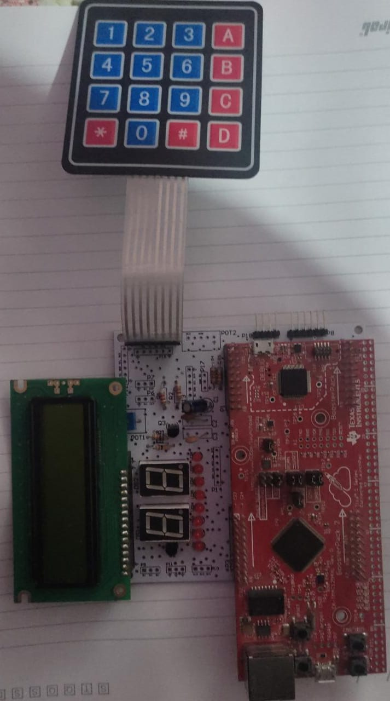

# Bobinador

<!DOCTYPE html>
<html>
<head>
  <meta charset="UTF-8">
 
</head>
<body>
  <h3>Bobinador utilizando o microcontrolador TM4C1294</h3>
  <h3>Visão Geral do Projeto</h3>
  <ul>
    <li><strong>Nome do Projeto:</strong> Controle de motor de passo</li>
    <li><strong>Descrição:</strong>Circuito de controle de um motor de passos, por meio da entrada de um teclado 4x4 matricial e um display 16x2 lcd. </li
  </ul>
  
  <h3>Componentes utilizados</h3>
    <ul>
    <li>  <h3>Conjunto montado</h3>
  
      </li>
    </ul>
 
  
</body>
</html>
